
<h1 align="center">招生宣传管理系统</h1>

## 简介
春季招生宣传管理系统：角色分为管理员和招生人员；功能包括政策查看与管理、信息公开、用户注册与登录、物资管理与销售、咨询记录录入、客服聊天以及公告和计划管理。    --计算机毕业设计源码；毕设源码；java毕业设计源码

## 联系方式

<h3 align="center">获取完整代码与数据库文件 + 微信：deepguan QQ: 86050149 QQ群: 783742310</h3>

<h3 align="center">可帮忙远程部署 包运行成功！提供远程部署、修改代码、设计文档指导、代码讲解等服务！</h3>

## 功能介绍（完整见运行截图）
管理员：管理员可以通过该系统执行多项核心管理功能。首先，他们可以管理用户信息，包括查看、修改、删除和重置用户密码等。管理员还负责管理和编辑各类招生政策和宣传内容，如公告发布、计划类型、信息公开等。同时，管理员可以对系统的基础数据进行管理，以及根据需要添加或删除物资类型。物资管理方面，他们能处理物资的添加、修改、删除及其消耗情况记录。此外，管理员也有权限上传和管理轮播图和单页文章，确保及时更新宣传资料。在客服模块中，管理员可以与访问者进行互动交流，提高用户体验和系统响应能力。

招生人员：招生人员在系统中的主要职责包括查看和管理招生计划以及相关政策信息。他们可以根据需要搜索和浏览多项招生政策，查看详细信息和发布记录，并通过分类按钮筛选特定类别的政策。此外，招生人员也能够录入和管理咨询记录，选择合适的咨询方式与时间，并添加备注与附件，以确保信息的全面性和准确性。在个人信息管理方面，招生人员可以修改自身信息如用户名、联系方式、头像等；提升个性化管理体验。物资查询也是招生人员的功能之一，他们可以按物资名称或类型进行检索，获取相关物资的详细情况，便于后续管理和规划使用。

## 运行截图
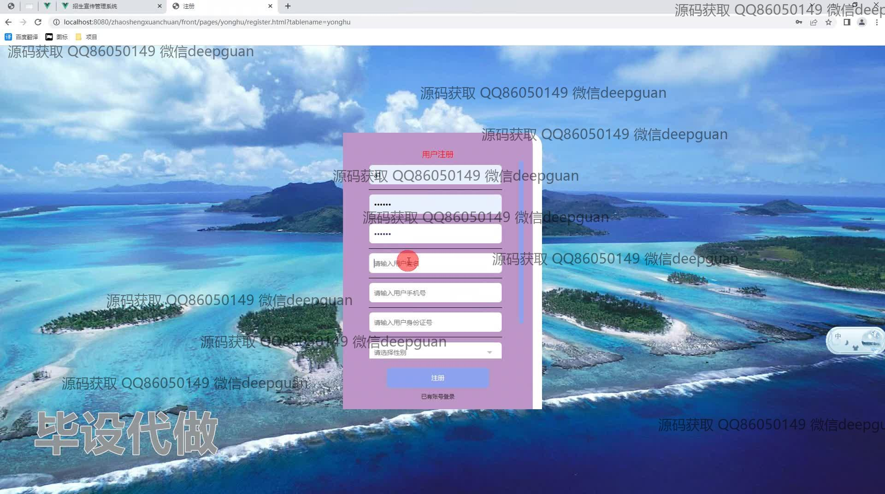
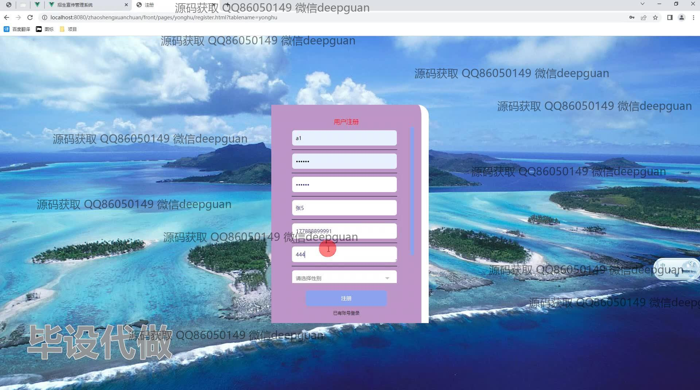
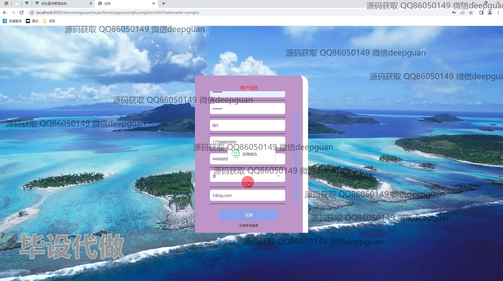
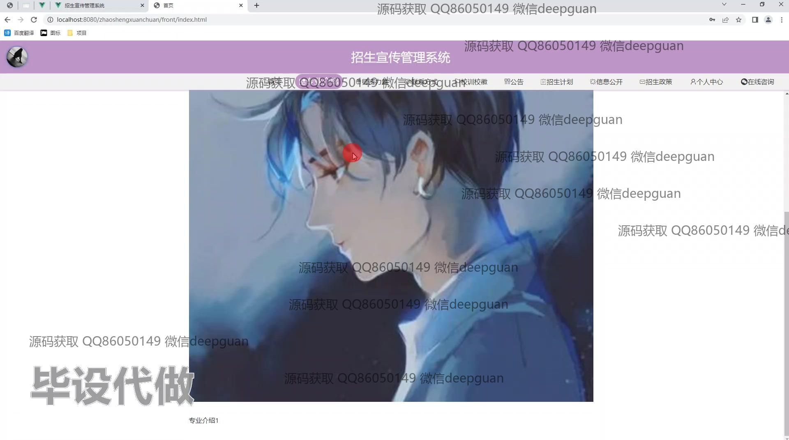
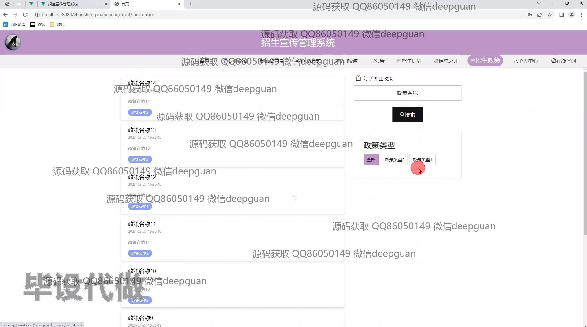

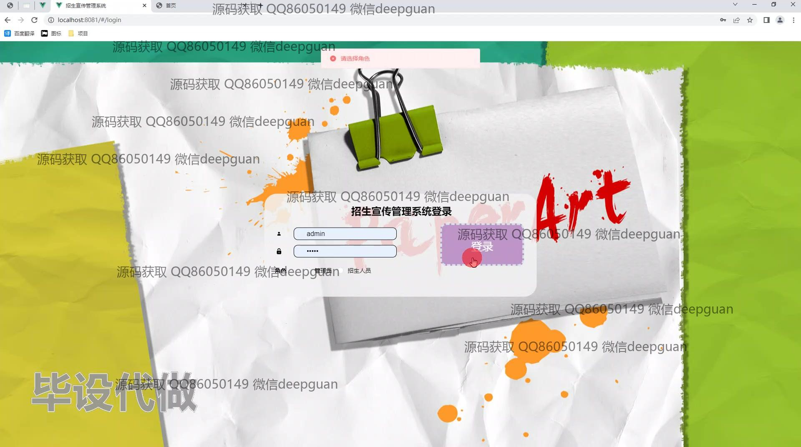
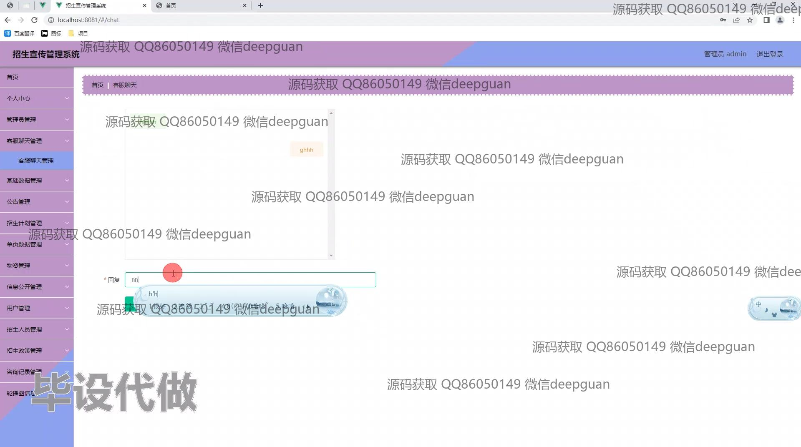
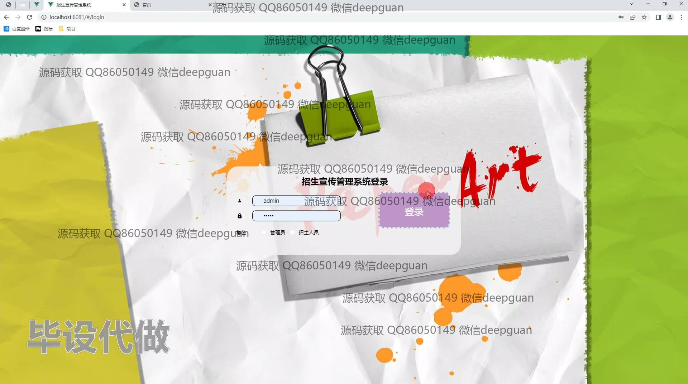
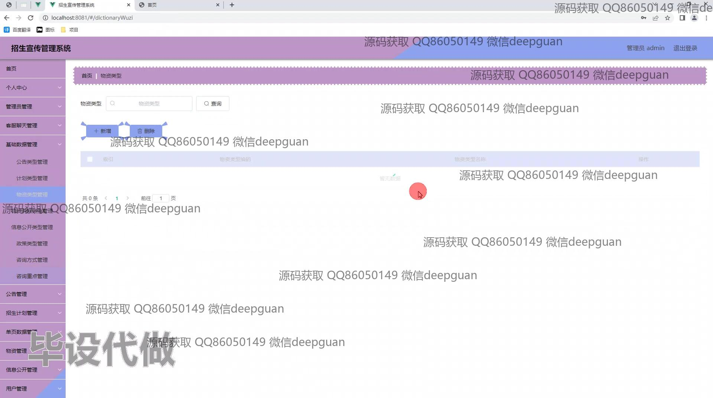
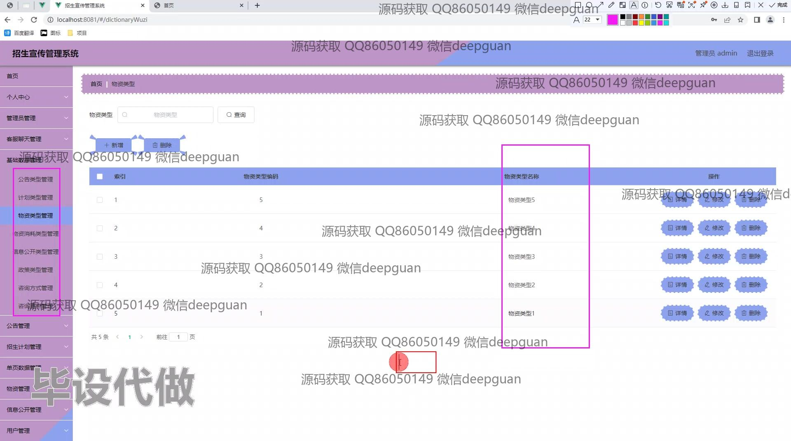
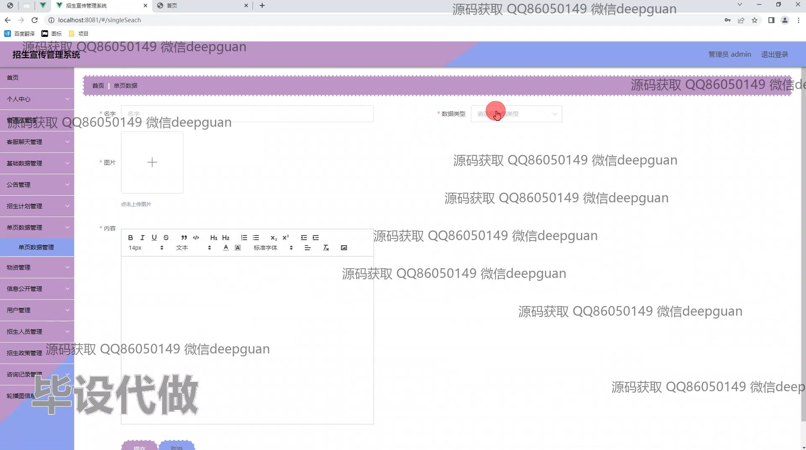
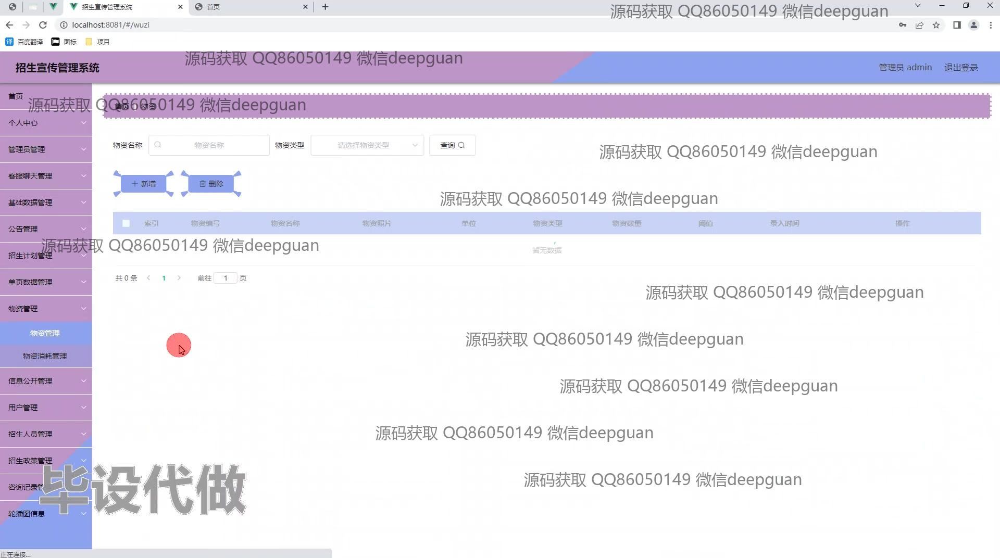
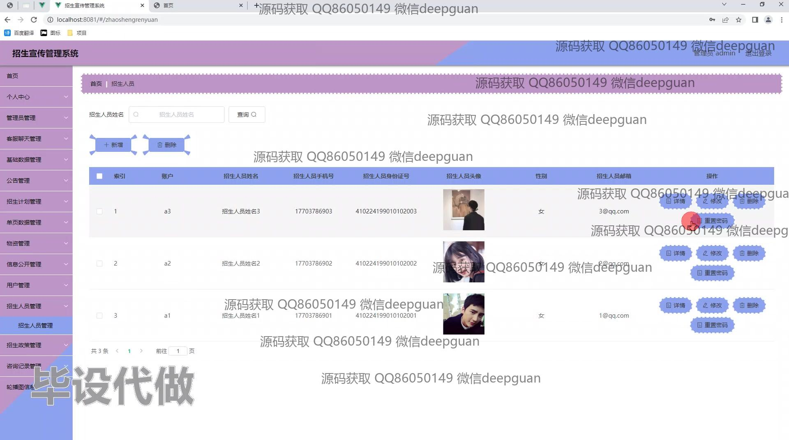
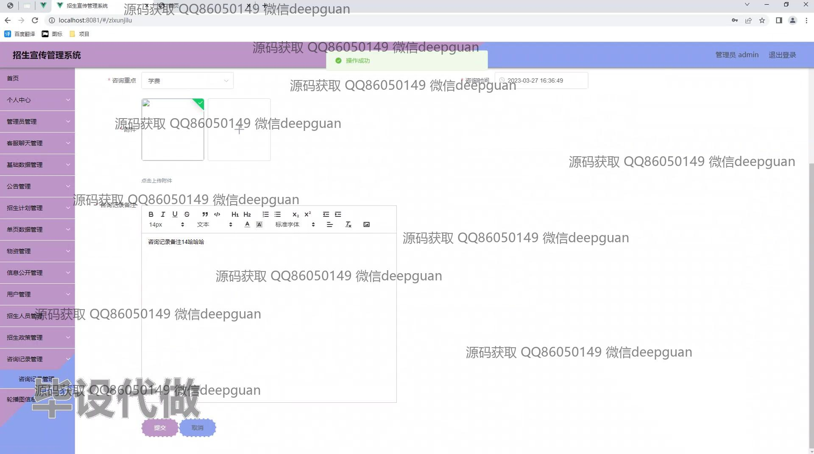
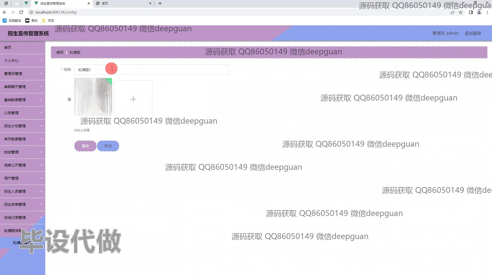
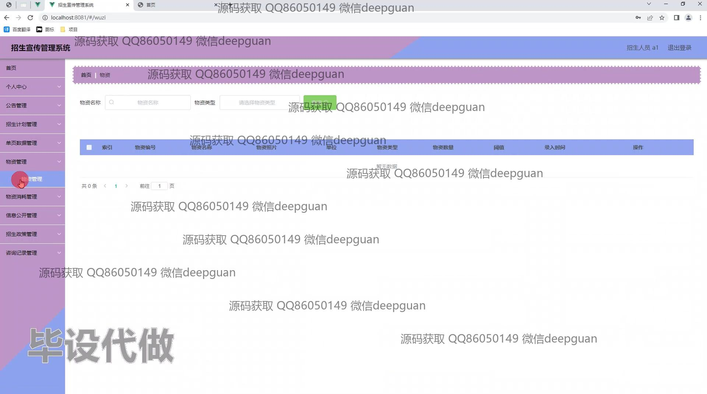

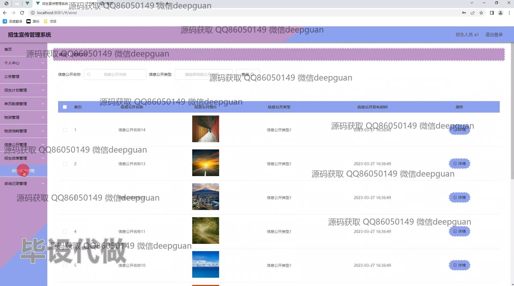
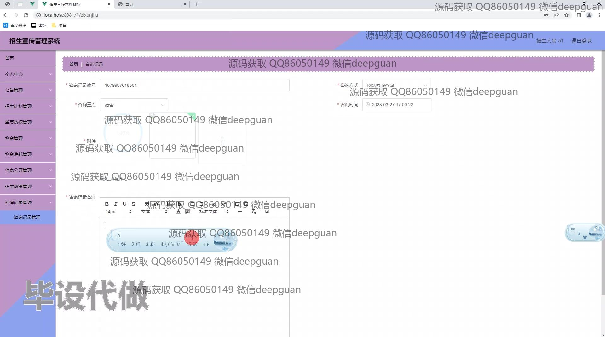

本代码来源于网络,仅供学习参考使用!

